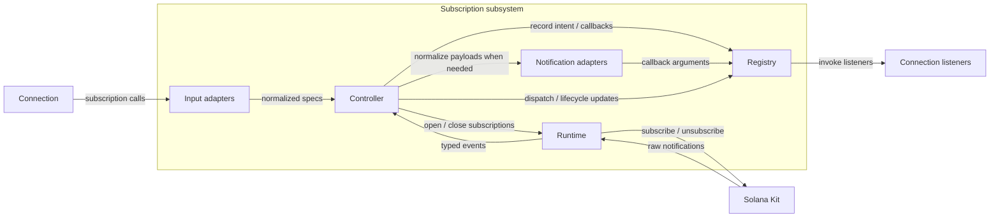

# Subscription Architecture

This document explains the internal subsystem that powers `Connection`'s RPC
websocket subscription APIs.

## Purpose

The subscription subsystem lets `Connection` stay focused on the public API
surface and high-level control flow while the subsystem owns:

- translating `Connection`-facing inputs into internal or Kit-facing forms
- opening, tracking, and closing Kit websocket subscriptions
- reconciling lifecycle state across reconnects and unsubscribe flows
- translating raw websocket payloads into `Connection` callback arguments
- multiplexing multiple client listeners onto a single server-side
  subscription when they are logically subscribing to the same thing

## Design

The main design choice in this subsystem is that `Connection` remains the
public subscription API, while Solana Kit provides the underlying RPC and
websocket transport.

- `Connection` is the stable, class-based API that callers already use. It
  owns user-facing defaults, overloads, compatibility behavior, and callback
  signatures.
- Solana Kit is the lower-level transport and protocol layer. It already knows
  how to express RPC requests and websocket subscriptions, so the internals use
  it instead of re-implementing transport behavior inside `Connection`.

The subscription subsystem takes care of the plumming to to wire Kit to
Connection, taking care of lower level concerns such as listener multiplexing,
subscription state tracking and reconciliation, as well as callback argument
shaping.

The subsystem splits its responsibility into adapters, `controller.ts`,
`registry.ts`, and `runtime.ts` instead of letting `Connection` talk directly
to Kit everywhere.

## Terminology

- Normalization means translating data from one boundary into the canonical
  shape expected at the next boundary without changing subscription semantics.
  Request-side normalization builds canonical internal forms such as
  `SubscriptionSpec`; notification-side normalization reshapes raw Kit payloads
  into the callback arguments `Connection` exposes.
- Subscription intent means the recorded desired state that `Connection` wants a
  logical subscription to exist, independent of whether the underlying
  websocket subscription is open right now. The controller and registry track
  that desired state; the runtime makes transport state match it.

## High-level flow

Registration direction:

1. `connection.ts` accepts `Connection`-facing subscription inputs.
2. `kit-adapters/subscription-specs.ts` builds a normalized `SubscriptionSpec`
   plus callback config.
3. `rpc-subscriptions/controller.ts` records subscription intent and
   reconciles runtime work.
4. `rpc-subscriptions/registry.ts` stores client registration and lifecycle
   state.
5. `rpc-subscriptions/runtime.ts` opens or closes Kit websocket subscriptions.

Notification direction:

1. Solana Kit emits a raw websocket notification.
2. `rpc-subscriptions/runtime.ts` receives it and emits a typed internal
   event.
3. `rpc-subscriptions/controller.ts` decides how to dispatch it.
4. `kit-adapters/*-notifications` normalize payloads when needed.
5. `rpc-subscriptions/registry.ts` dispatches the resulting callback
   arguments to listeners.

The controller sits in the middle of both directions of flow. `Connection` calls
into it to express subscription intent, and the runtime calls back into it with
transport lifecycle changes and incoming notifications.

## Component diagram

## Module roles

- `src/connection.ts` is the public API boundary. It accepts subscription API
  calls, applies Connection-facing defaults and compatibility behavior, and
  wires together the internal components.
- `src/kit-adapters/request.ts` translates Connection request shapes into
  the explicit Kit RPC request configs used at the request boundary.
- `src/kit-adapters/subscription-specs.ts` translates Connection subscription
  inputs into canonical `SubscriptionSpec` values consumed by the internal
  subscription subsystem.
- `src/rpc-subscriptions/controller.ts` is the orchestration layer. It turns
  Connection intent and runtime events into registry state changes, runtime
  work, and callback dispatch.
- `src/rpc-subscriptions/registry.ts` is the durable state store for client
  registrations, callback sets, server subscription handles, dispatch config,
  and lifecycle observers.
- `src/rpc-subscriptions/runtime.ts` owns Kit websocket transport. It opens
  and maintains websocket subscriptions and emits typed internal events.
- `src/kit-adapters/account-notifications.ts` and
  `src/kit-adapters/block-notifications.ts` translate raw Kit websocket
  payloads into the callback argument shapes Connection exposes.
- `src/kit-adapters/response.ts` centralizes shared Kit-to-Connection
  result shaping reused by request methods and notification adapters.
- `src/kit-adapters/subscription-types.ts` defines Connection's public
  subscription config, callback, and result types.

## Where to extend behavior

- Add or adjust public-facing input normalization in `connection.ts` or
  `subscription-specs.ts`.
- Add transport-opening logic in `runtime.ts`.
- Add lifecycle reconciliation or dispatch behavior in `controller.ts`.
- Add durable state or observer bookkeeping in `registry.ts`.
- Add payload decoding or result-shape mapping in the adapter modules.

If a change appears to need all of those at once, the boundary placement is
probably wrong.
